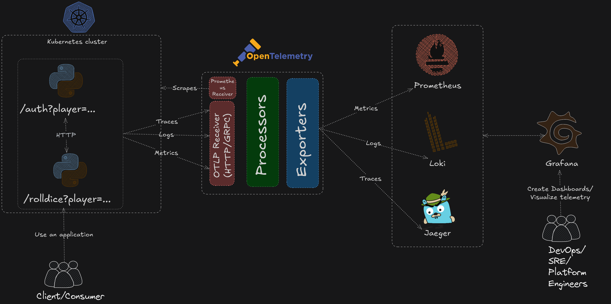

# Basic Observability Pipeline using OpenTelemetry (logs, metrics, traces) #

This directory contains a basic example of an observability pipeline built using the OpenTelemetry Collector. It showcases how to collect, process, and export telemetry data — including metrics, logs, and traces — in a unified pipeline.

Metrics from auxiliary services are scraped using OpenTelemetry's [Prometheus Receiver](https://github.com/open-telemetry/opentelemetry-collector-contrib/blob/main/receiver/prometheusreceiver/README.md) and stored using Prometheus, while logs are ingested via Loki. Jaeger is integrated to handle tracing data, enabling distributed tracing across services. Grafana is used to visualize all collected telemetry through dashboards for easy monitoring and analysis. The deployed applications emits metrics, logs and traces through [OpenTelemetry's SDK for Python](https://github.com/open-telemetry/opentelemetry-python) using [auto-instrumentation injection feature](https://opentelemetry.io/docs/platforms/kubernetes/operator/automatic/) and push them to the collector using _OTLP HTTP/gRPC_ receiver.

The entire stack is deployed on a local Kubernetes cluster created with [Kind (Kubernetes in Docker)](https://kind.sigs.k8s.io/). [Helm](https://helm.sh/) and [Helmfile](https://github.com/helmfile/helmfile) are used to manage the deployment of each component, ensuring a consistent and repeatable setup.



## Quick Start ##

Create cluster using Kind:

```bash
kind create cluster --config kind-config.yaml
```

Install Observability Pipeline and Telemetry stack (Prometheus, Grafana, Loki, Jaeger) using helmfile:

```bash
helmfile sync
```

> It could take several minutes to actually deploy all of the resources, be patient!

This will install all auxiliary (ingress-nginx, cert-manager, otel operator) and observability services in a single command. You can inspect Helm `values.yaml` for all services either in the `helmfile.yaml` or in a dedicated directory for the service.

Create a namespace for applications:

```bash
kubectl apply -f flask/dice-server-auto/namespace.yaml
```

Apply the ingresses located in the `ingress/` directory:

```bash
kubectl apply -f ingress/
```

Deploy an example apps, which will emit telemetry data through auto-instrumentation using Python SDK:

```bash
kubectl apply -f flask/dice-server-auto/
```

To reach rolldice HTTP server application:

```bash
# This will hit the API as anonymous user
curl http://localhost/flask/rolldice

# To roll a dice as a "user"
curl http://localhost/flask/rolldice?player=<PLAYER_NAME>
```

A successful response from the rolldice API is a single value from range 1-6 which denotes rolled value of a dice.

Hit the rolldice API couple of times (or in a loop) to generate some telemetry data.

> You may notice, that there are actually two services, rolldice and auth, with the latter not being exposed through ingres. </br>
The reason is that _auth_ service is a mock server, which in the real-world scenario could verify user's identity when trying to roll a dice using rolldice server. In the context of the demo, it logs "anonymous" dice rolls with a "ERROR" log severity for better showcase of an importance of logs.

(Optional) Instead of hitting rolldice API yourself, you can run a load testing against rolldice server using [Locust](https://locust.io/) (assuming you have Python installed). You can find the Locust task file in `flask/locust/`.

To install and run Locust task:

```bash
pip install locust
locust --headless --users 1 --spawn-rate 0.01 -f flask/locust/locustfile.py -t 10s -s 5
```

This will spawn a single user for each task (X, Y, Z and Anonymous) without running UI server, with a spawn rate of _0.01_ users per second and hit the rolldice API for _10_ seconds.

You can access any of the following URLs to view the telemetry from the apps (and other services in case of metrics):

* Prometheus - <http://localhost/prometheus>
* Jaeger - <http://localhost/jaeger>
* Grafana - <http://localhost/grafana>

> For Grafana, you may need to retrieve a password and login as an admin (even though the login page is hidden and default role is admin)</br>
> Run `helm get notes grafana -n grafana` for instructions on retrieving password from the secret

To clean up the Kind cluster run:

```bash
# Assuming you didn't change the cluster name in kind-config.yaml
kind delete cluster -n otel
```
